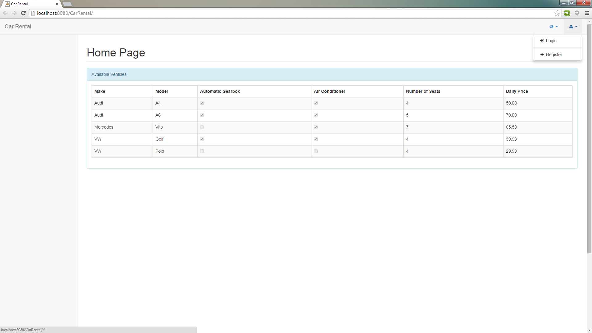
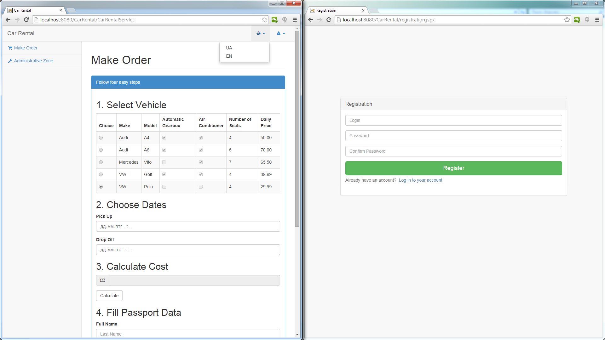
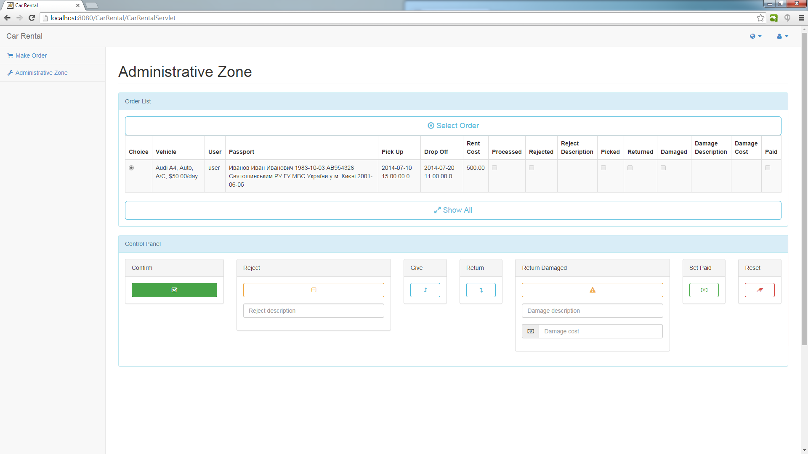

CarRental
=========

The project is a car rental system with user and administrator sides.
User can choose a car, calculate its rent cost for a given period, and make an order.
Administrator can review all the orders, confirm or reject the specific order, and set special marks to it.

To see the full size image press it and select "Raw".

#### Features:
- Information is stored in MySQL database with access via JDBC;
- GoF (Factory Method, Command, Singleton) and MVC patterns used;
- Project is based on Servlet and JSP;
- JSP contains custom tags;
- Project contains filters and operates with sessions;
- Cyrillic alphabet is fully supported;
- Event logging with Log4j.

## UML class diagram

